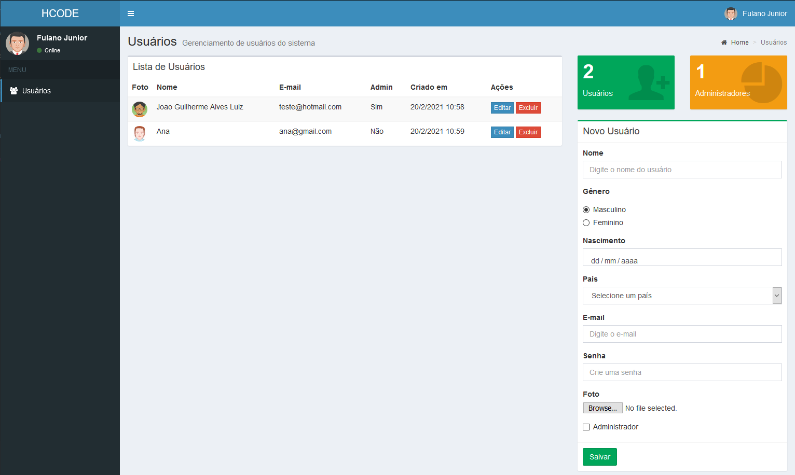

<!-- Title --> 
# User Management

<!-- Project Image --> 

  

<!-- Who made it --> 
##### Tutorial by Hcode
<!-- About the project --> 
## About 

In this project we will build a CRUD for User Management, using JSON, localStorage and more features. 

<!-- Features Used in --> 
## Features Used 
 * JSON.
 * MVC.
 * Object Oriented.
 * Create, Read, Update, Delete.
 * localStorage.

  

<!-- See website --> 
[Check Live](https://ger-usuario.netlify.app)
<!-- See tutorial video  --> 
<!-- [Video](https://www.youtube.com/watch?v=p0bGHP-PXD4&t) -->

### Contact
E-mail: joaog.alvesluiz@gmail.com
